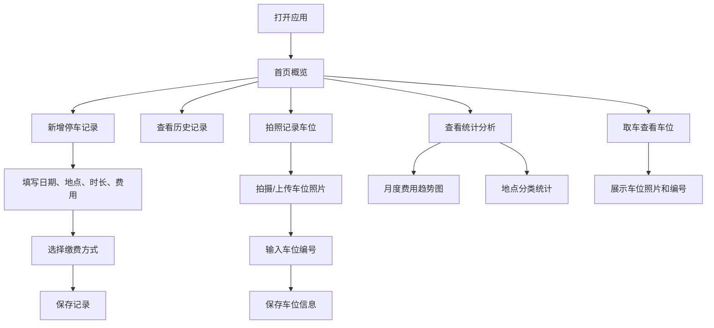

## 1. 产品概述
停车管理工具，帮助用户记录每次停车信息、管理停车费用、查看统计分析，并通过拍照记录车位便于取车。
- 目标用户：有车一族，日常需要频繁停车的上班族、车主
- 产品价值：系统化管理停车费用支出，快速找到车辆停放位置

## 2. 核心功能

### 2.1 功能模块
1. **首页/仪表盘**：当月停车总览、最近停车记录、快捷操作入口
2. **停车记录**：新增停车记录、查看历史记录、编辑/删除记录
3. **费用统计**：月度费用趋势图、按地点分类统计
4. **车位记录**：拍照记录车位编号、取车时查看车位照片

### 2.3 页面详情
| 页面名称 | 模块名称 | 功能描述 |
|-----------|-------------|---------------------|
| 首页 | 月度概览卡片 | 显示当月停车次数、总费用、平均费用 |
| 首页 | 最近记录列表 | 展示最近5条停车记录，可点击查看详情 |
| 首页 | 快捷操作 | 快速新增停车记录、快速查看当前车位 |
| 停车记录页 | 记录列表 | 按时间倒序展示所有停车记录，支持筛选和搜索 |
| 停车记录页 | 新增记录表单 | 日期选择、地点输入/地图选点、停车时长、缴费金额、缴费方式选择 |
| 停车记录页 | 记录详情 | 展示单条停车记录完整信息，支持编辑和删除 |
| 统计分析页 | 月度趋势图 | 展示最近6个月停车费用折线图 |
| 统计分析页 | 地点分类统计 | 按地点汇总费用，以列表+环形图展示 |
| 车位记录页 | 拍照/上传 | 调用摄像头拍照或从相册上传车位照片 |
| 车位记录页 | 车位信息 | 手动输入车位编号（如B2-035）、选择楼层区域 |
| 车位记录页 | 取车模式 | 全屏展示车位照片和编号，便于快速定位车辆 |

## 3. 核心流程
用户打开应用后，可在首页快速新增停车记录，填写停车日期、地点（通过地图选点或手动输入）、停车时长、费用金额及缴费方式。停车时可拍照记录车位编号和位置。在统计分析页面，用户可以查看月度费用趋势图和按地点分类的费用统计。取车时，用户进入车位记录页面查看拍摄的车位照片和编号。

## 4. 用户界面设计

### 4.1 设计风格
- **主色调**：深海蓝 #0F3460（稳重、专业）
- **强调色**：琥珀橙 #E94560（活力、警示）
- **辅助色**：浅蓝灰 #533483、米白 #F5F5F5
- **按钮风格**：圆角矩形，12px 圆角，主按钮填充主色调，次按钮描边
- **字体**：标题使用 Noto Sans SC Bold，正文使用 Noto Sans SC Regular
- **布局风格**：卡片式布局，顶部 Tab 导航，模块间留有充足留白
- **图标风格**：使用 Lucide 线性图标，保持简洁统一

### 4.2 页面设计概述
| 页面名称 | 模块名称 | UI 元素 |
|-----------|-------------|-------------|
| 首页 | 月度概览卡片 | 渐变背景卡片，大号数字展示费用，微动画加载效果 |
| 首页 | 最近记录列表 | 白色卡片，地点+时间+费用信息，悬浮阴影效果 |
| 首页 | 快捷操作 | 圆形图标按钮，点击缩放动画 |
| 停车记录页 | 表单 | 分组输入框，地图选点弹窗，下拉选择器 |
| 统计分析页 | 趋势图 | 平滑折线图，渐变色填充区域，数据点悬浮提示 |
| 统计分析页 | 地点统计 | 环形图+列表结合，色块对应地点分类 |
| 车位记录页 | 取车模式 | 深色背景全屏展示，大号车位编号，照片轮播 |

### 4.3 响应式
- 桌面端优先，采用 1200px 居中布局
- 移动端适配：断点 768px，卡片变为全宽，导航移至底部
- 所有触控元素最小 44px 触控区域
