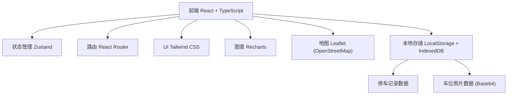
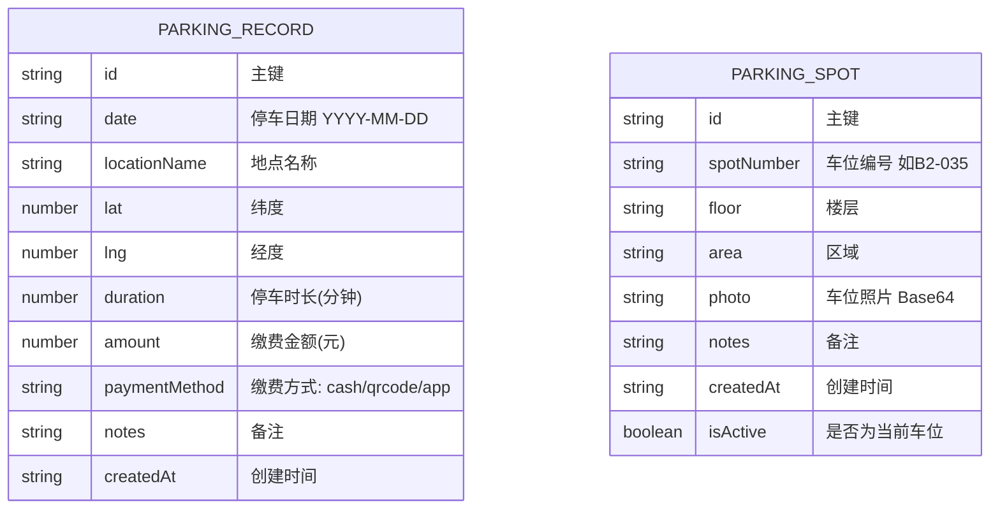

## 1. 架构设计



## 2. 技术描述
- **前端**：React@18 + TypeScript + Vite
- **初始化工具**：vite-init
- **样式**：tailwindcss@3
- **路由**：react-router-dom
- **状态管理**：zustand
- **图表库**：recharts
- **地图**：leaflet + react-leaflet（使用 OpenStreetMap 免费瓦片，无需 API Key）
- **图标**：lucide-react
- **数据存储**：LocalStorage 存储结构化数据，照片以 Base64 存入 IndexedDB（或 LocalStorage 限制大小）
- **后端**：无（纯前端应用，数据本地持久化）

## 3. 路由定义
| 路由 | 用途 |
|-------|---------|
| / | 首页/仪表盘，月度概览和最近记录 |
| /records | 停车记录列表 |
| /records/new | 新增停车记录 |
| /records/:id | 停车记录详情/编辑 |
| /statistics | 费用统计分析 |
| /parking-spot | 车位记录/取车页面 |

## 4. 数据模型

### 4.1 数据模型定义



### 4.2 数据结构（TypeScript 类型）

```typescript
// 缴费方式
type PaymentMethod = 'cash' | 'qrcode' | 'app';

// 停车记录
interface ParkingRecord {
  id: string;
  date: string;
  locationName: string;
  lat: number | null;
  lng: number | null;
  duration: number;
  amount: number;
  paymentMethod: PaymentMethod;
  notes?: string;
  createdAt: string;
}

// 车位记录
interface ParkingSpot {
  id: string;
  spotNumber: string;
  floor?: string;
  area?: string;
  photo?: string;
  notes?: string;
  createdAt: string;
  isActive: boolean;
}

// 按地点统计
interface LocationStats {
  locationName: string;
  totalAmount: number;
  count: number;
}

// 月度统计
interface MonthlyStats {
  month: string;
  totalAmount: number;
  count: number;
}
```
